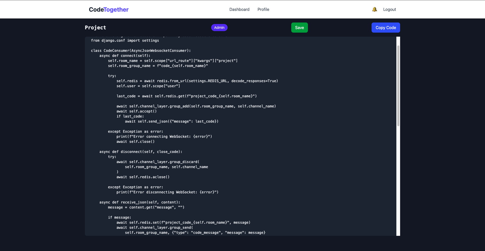

# CodeTogether

  

## Description  

**CodeTogether** is a real-time collaborative code editor that allows multiple users to work on the same project simultaneously. It provides seamless synchronization through WebSockets and a structured user authentication system. This application was built to facilitate pair programming, collaborative coding sessions, and real-time project management.  

## Getting Started  

### Deployed App  
🔗 [Live Demo](https://your-deployed-app-url.com)  

### Planning Materials  
📌 [Trello Board](https://your-planning-url.com)  
📌 [Wireframes](https://your-wireframes-url.com)  
📌 [ERD (Entity Relationship Diagram)](https://your-erd-url.com)  

## Features  

- 🔄 **Real-time code synchronization** using WebSockets  
- 🔐 **User authentication** with JWT  
- 🏗 **Project-based collaboration**  
- 👥 **Role-based access control** (Admin, Editor, Viewer)  
- 🔔 **Notification system** for project updates  
- 🌙 **Dark mode** for improved UI/UX  
- 🎨 **Syntax highlighting** with Prism.js  
- 📦 **Backend API** with Django REST Framework  

## Technologies Used  

### Frontend  
- React.js  
- Tailwind CSS  # CodeTogether

  

## Description  

**CodeTogether** is a real-time collaborative code editor that allows multiple users to work on the same project simultaneously. It provides seamless synchronization through WebSockets and a structured user authentication system. This application was built to facilitate pair programming, collaborative coding sessions, and real-time project management.  

## Getting Started  

### Deployed App  
🔗 [Live Demo](https://livecodetogether.netlify.app/)  

### Planning Materials  
📌 [Trello Board](https://trello.com/b/hfqBmhGe/codetogether)  
📌 [Wireframes](https://www.figma.com/design/tEwRUuSc7ZxR3HTO6x688o/Untitled?node-id=0-1&p=f&t=edWkixoDN54pM3BH-0)  
📌 [ERD (Entity Relationship Diagram)](https://lucid.app/lucidchart/7478615e-353c-4e0c-a709-9e6ef92c138b/edit?viewport_loc=727%2C-309%2C2217%2C1116%2C0_0&invitationId=inv_b06caff1-a81e-4812-808d-85820b448d4b)  

## Features  

- 🔄 **Real-time code synchronization** using WebSockets  
- 🔐 **User authentication** with JWT  
- 🏗 **Project-based collaboration**  
- 👥 **Role-based access control** (Admin, Editor, Viewer)  
- 🔔 **Notification system** for project updates  
- 🌙 **Dark mode** for improved UI/UX  
- 🎨 **Syntax highlighting** with Prism.js  
- 📦 **Backend API** with Django REST Framework  

## Technologies Used  

### Frontend  
- React.js  
- Tailwind CSS  
- Prism.js  
- Axios  

### Backend  
- Django & Django REST Framework  
- Django Channels (WebSockets)  
- PostgreSQL  
- Redis  
- JWT Authentication  

## Attributions  

This project uses the following external resources:  
- [Prism.js](https://prismjs.com/) for syntax highlighting  
- [Tailwind CSS](https://tailwindcss.com/) for styling  
- [Django REST Framework](https://www.django-rest-framework.org/)  
- [Django Channels](https://channels.readthedocs.io/) for WebSocket integration  

## Next Steps  

- ✅ Improve UI/UX with animations and better styling  
- ✅ Expand the notification system to include more project events  
- ✅ Implement file-based collaboration support  
- ✅ Add an integrated AI-powered code suggestion feature  

📌 **Developed by:** Luis Curiel  
🔗 **GitHub:** [github.com/luiscuriel-bit](https://github.com/luiscuriel-bit)  